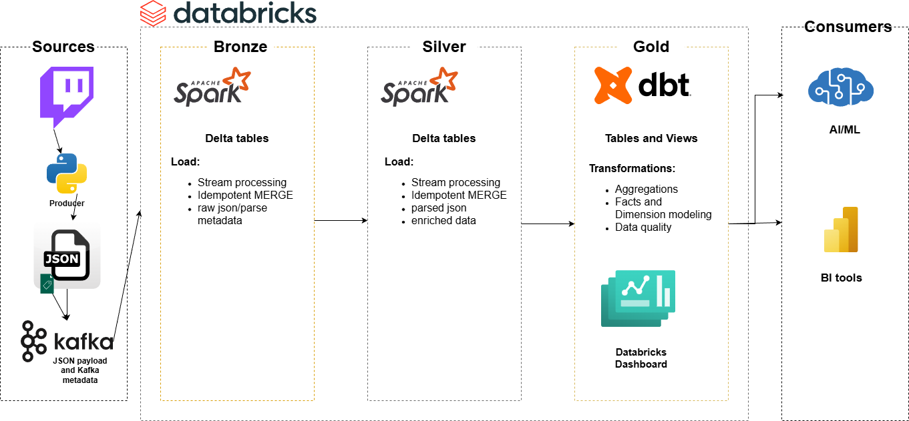

# Twitch Chat Streaming Analytics Pipeline




## 📖 Overview
This project implements an end-to-end **real-time data pipeline** for ingesting, processing, and analyzing Twitch chat messages using a modern lakehouse architecture.

The pipeline demonstrates:
- Twitch chat ingestion via Kafka
- Spark Structured Streaming with `foreachBatch`
- Medallion architecture (Bronze -> Silver -> Gold)
- dbt-based testing and Gold modeling
- Databricks-native orchestration and dashboards

The primary goal of this project is to showcase **streaming ingestion correctness, data contracts, governance and analytical modeling**, rather than purely batch ETL.
This project intentionally prioritizes streaming ingestion and Kafka correctness over complex BI modeling.

---

## 🏗️ Architecture
Kafka → Spark Structured Streaming → Delta Lake (Bronze/Silver)
→ dbt (Gold models + tests)
→ Databricks Dashboards

### Key Technologies
- **Kafka** – real-time message ingestion
- **Spark Structured Streaming** – micro-batch processing
- **Delta Lake** – transactional storage
- **Databricks** – execution, orchestration, visualization
- **dbt** – testing, transformations, lineage

---

## 🧱 Data Layers

### 🟤 Bronze: Raw Ingestion

The Bronze layer stores the raw, immutable Kafka event log.

- One row per Kafka message
- Delta table designed for lossless ingestion and replayability
- Each record is uniquely identified by (topic, partition, offset)
- Stores the raw JSON payload exactly as received

In addition to the raw payload, Bronze tracks operational metadata:

- ingest_ts
- parse_status (OK / PARSE_ERROR)
- parse_error (nullable)

Data is ingested in an append-first manner, with idempotent MERGE semantics used to:

- Prevent duplicate inserts during Spark streaming retries
- Safely annotate records with parsing outcomes

---

### ⚪ Silver: Parsed & Enriched
- Only successfully parsed messages
- JSON fields extracted into columns
- Enriched with:
  - sentiment scores
  - message length
  - entropy
  - emote metrics
  - engagement flag

The Silver schema represents a **locked data contract**:
- `topic + partition + offset` uniquely identify a message
- All downstream consumers rely on this contract

---

### 🟡 Gold: Analytics Models (dbt)
Gold models are built using dbt and materialized as fact and dimension tables.

Examples:
- Sentiment distribution over time
- Message volume by minute
- Engagement vs non-engagement messages
- Emote-only message analysis

Gold models are optimized for **dashboarding and BI consumption**.

---
## ▶️ How to Run (High-Level)

- Provision Kafka (local or managed)
- Start Python producer to ingest Twitch chat
- Run Spark Structured Streaming job
- Bronze/Silver tables populated via idempotent MERGE
- Downstream Gold transformations run via dbt
- Unity Catalog manages governance, lineage, and access

---
## 🧪 Data Quality & Contracts

Data quality is enforced at multiple layers:

### Ingestion-time
- Schema enforcement via `from_json`
- Explicit `parse_status` handling
### dbt Tests
- Not-null constraints
- Range checks for sentiment scores
- Uniqueness across `(topic, partition, offset)`
- Semantic expectations on Silver tables

---

## 🧭 Orchestration

- Streaming ingestion runs continuously via Spark Structured Streaming
- dbt models are executed as a **Databricks Job**
- dbt project is stored in a **Git-backed Databricks Repo**
- dbt commands:
  ```bash
  dbt deps
  dbt run
  dbt test
  ```

## 🧬 Documentation & Lineage

- dbt provides logical lineage and documentation
- Unity Catalog tracks physical lineage and table usage
- A Github Actions workflow was setup to deploy the dbt docs as a gh-page and merge to main branch on every commit.
  - This allows you to view always updated dbt docs and saves time in the long run by automating this process.
- 📘 **Live dbt documentation:** [https://jrmiahcodes.github.io/kafka_databricks_pipeline/](https://jrmiahcodes.github.io/kafka_databricks_pipeline/)

---

## 🧠 Key Learnings

- A key moment was figuring out that Spark Structured Streaming guarantees **at-least** once execution:
  - Streaming pipelines require explicit idempotency handling to prevent duplicate writes
  - MERGE-based writes replaced append-only semantics to account for this

- Intensive actions inside foreachBatch can trigger replays
  - Use of .cache()/.persist() in the batch prevents redundant reprocessing  
   
- dbt integrates cleanly with Databricks for testing and modeling

- Running Kafka locally was a huge pain fraught with a ton of debugging.
  - This elucidated to me the advantage of managed Kafka systems like Confluent Cloud for production
  
## 🔮 Future Improvements

**Quite a few future improvements and ideas having worked through this project:**
  - Using a python consumer isn't the best for throughput, in the future I'd rather ingest the kafka json as is into the bronze layer,
    keep it as a raw source of truth and do the enrichment process purely in the silver layer. I ended up doing more enrichment during the silver
    layer with Spark anyway, those 2 enrichment processes could have been consolidated. If a Kafka connect source is permitted that would be better
    for producing but in this case no Kafka Source connector existed for Twitch Chat.
 - Sentiment analysis quality is limited by general-purpose models; Twitch-specific language would benefit from domain-adapted NLP. Twitch
   lingo is nuanced/subtle and I would find a better way to analyze sentiment in the future.
 - Instead of doing enrichment during the batch ingestion process, I think better and more in line with medallion architecture is to leave
   the enrichments to a dbt model in the silver layer. Though utilizing Spark in this way was educational and has its purpose, separating it
   would create a better boundary of layers looking back on it.
 - Based on what channel you want to analyze, you would have to create a detailed list of emotes that channel has enabled whether through 7tv or
   BetterTTV. That would enable emote analytics to function accurately..I laid the groundwork to do that with the emote_token list, that's
   something to customize further based on the channel chats you'd want to ingest. 


## 👤 Author

Built by Jeremiah Garcia as a portfolio project focused on real-time data engineering, Kafka with Spark streaming ingestion and lakehouse architecture.

## 🛡️ License

This project is licensed under the [MIT License](LICENSE). You are free to use, modify, and share this project with proper attribution.
