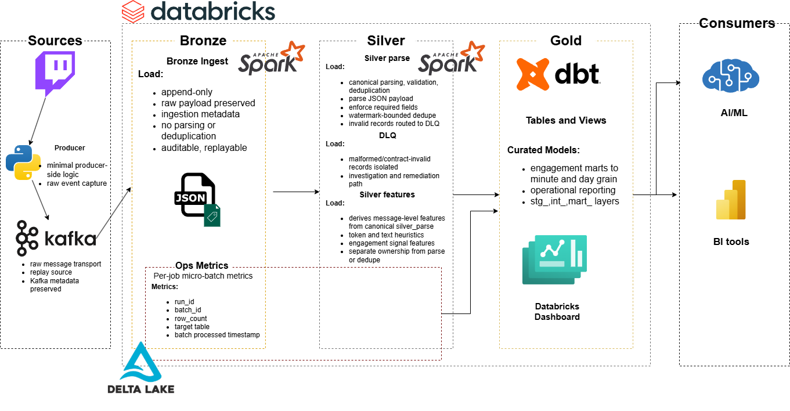

# v2: Streaming Reliability and Engagement Analytics Pipeline

This version rebuilds the original Twitch chat pipeline with clearer streaming boundaries, explicit dead-letter handling, and measured operational behavior.

The goal of v2 is not just to preserve the end-to-end flow from v1. It is to make the pipeline easier to reason about, easier to benchmark, and easier to defend from a data engineering perspective. Bronze remains raw and append-only, Silver owns parsing and contract enforcement, feature derivation is separated from canonical parsing, and downstream dbt models expose both engagement and operational views of the system.

## Key Artifacts

- 
- [Data contract](contracts/data_contracts.yaml)
- [FinOps and benchmark report](docs/finops_report.md)

## Table of Contents

- [Why v2 Exists](#why-v2-exists)
- [Pipeline Overview](#pipeline-overview)
- [Layer Responsibilities](#layer-responsibilities)
- [Operational Benchmarking and Cost Analysis](#operational-benchmarking-and-cost-analysis)
- [Reliability and Stress Testing](#reliability-and-stress-testing)
- [dbt Serving Layer](#dbt-serving-layer)
- [Repository Structure](#repository-structure)
- [Runtime and Dependency Files](#runtime-and-dependency-files)
- [Kafka and Job Configuration](#kafka-and-job-configuration)
- [Documentation](#documentation)

## Why v2 Exists

Compared with v1, this version emphasizes:

- clearer Bronze, Silver, and Gold responsibilities
- append-only raw Bronze ingest
- Silver as the canonical parsed contract boundary
- explicit DLQ routing for malformed or invalid records
- separate feature derivation from parsing and deduplication logic
- per-job micro-batch benchmark metrics using `run_id` and `batch_id`
- measured comparison of batch behavior and cost posture between v1 and v2
- dbt serving models for engagement and operational reporting

The earlier secondary enrichment consumer is not part of the main v2 architecture. It is preserved as historical context from v1 only.

## Pipeline Overview

The current end-to-end flow is:

1. A Python producer captures Twitch chat events
2. Events are sent to Kafka
3. `bronze_ingest` writes the raw payload into a Bronze Delta table
4. `silver_parse` reads Bronze, parses the payload, validates required fields, assigns `event_id`, and deduplicates valid records
5. Invalid or unparseable records are written to a DLQ table
6. `silver_features` reads the canonical parsed Silver output and derives lightweight message features
7. dbt builds downstream serving models for engagement analysis and operational reporting

## Layer Responsibilities

### Bronze

`bronze_ingest` is responsible for raw capture only.

Responsibilities:

- read from Kafka
- preserve the raw event payload
- record ingestion metadata and source coordinates
- stamp micro-batch operational metadata
- write append-only records into Bronze

Bronze does not enforce the parsed contract and does not perform deduplication.

### Silver Parse

`silver_parse` is the canonical parsing and validation boundary.

Responsibilities:

- read raw Bronze records
- parse the raw JSON payload
- normalize key fields such as channel, chatter, and message text
- assign `event_id` from topic, partition, and offset
- validate required fields
- deduplicate valid records with watermark-bounded `dropDuplicates`
- route invalid or unparseable records to the DLQ
- emit per-batch operational metrics for benchmark analysis

Outputs:

- `silver_parsed_table`
- `dlq_table`

### Silver Features

`silver_features` reads the canonical parsed Silver output and derives lightweight message-level features.

Responsibilities:

- read from `silver_parsed_table`
- add heuristic text features
- write a separate append-only features table
- emit per-batch operational metrics for downstream analysis

This job does not own parsing, contract enforcement, or deduplication.

Current derived fields include:

- `token_count`
- `alpha_char_count`
- `numeric_char_count`
- `link_count`
- `candidate_emote_token_count`
- `repeat_char_ratio`
- `text_complexity_proxy`
- `event_to_feature_latency_seconds`
- `has_repeat_spam_pattern`
- `engagement_signal`
- `feature_processed_ts`

## Operational Benchmarking and Cost Analysis

v2 adds explicit batch-level operational metadata to support benchmark analysis across the three streaming jobs.

Each streamed write can emit:

- `_run_id`
- `_job_name`
- `_batch_id`
- `_batch_processed_ts`

In addition, the pipeline can write one compact benchmark row per micro-batch into `OPS_METRICS_TABLE`, including:

- `run_id`
- `job_name`
- `batch_id`
- `batch_processed_ts`
- `row_count`
- `target_table`

This makes it possible to compare v1 and v2 using measured job behavior rather than only architectural intent.

The benchmark and cost analysis work in this project is intended to answer questions such as:

- how batch shapes differ across `bronze_ingest`, `silver_parse`, and `silver_features`
- how the v2 split affects throughput and processing behavior compared with v1
- how malformed-record routing affects downstream table cleanliness and replayability
- how measured runtime behavior maps to Databricks and cloud cost inputs
- how cost per million messages changes under different workload patterns

The supporting cost analysis is documented in [`docs/finops_report.md`](docs/finops_report.md). A measured baseline replay (`v2_baseline_backlog_2026_03_16`) processed `7006` Bronze rows into `7005` valid parsed rows, `7005` feature rows, and `1` DLQ row. `system.billing.usage` attributed `0.3465 DBU` of dedicated Jobs compute across the three streaming stages, with the main finding that cluster startup and orchestration overhead dominated elapsed time at this workload.

## Reliability and Stress Testing

v2 is designed to be evaluated under both real and synthetic workloads.

The validation approach includes:

- baseline runs against real backlog data
- synthetic scale testing to simulate higher sustained throughput
- burst testing to observe batch behavior under sudden message spikes
- malformed-record injection to validate DLQ routing under stress
- batch-level comparison using `run_id` and `batch_id` metadata

These tests are intended to make reliability claims more concrete, especially around:

- replayability
- bounded deduplication behavior
- DLQ isolation of malformed or contract-invalid records
- throughput stability under uneven traffic
- observability of batch shape and processing volume

## dbt Serving Layer

The dbt project in `src/dbt/` models curated Silver outputs into downstream analytical layers.

Current modeling areas include:

- Silver staging models for parsed events, feature outputs, and DLQ records
- operational staging for streaming batch metrics
- intermediate engagement models
- intermediate operational models
- Gold serving models for engagement and operational reporting

The serving layer is intended to support both engagement analytics and pipeline operations.

Example downstream use cases include:

- engagement trend analysis
- minute-level and daily channel rollups
- DLQ monitoring and failure pattern analysis
- per-job micro-batch reporting
- stakeholder-facing metrics built from curated stream outputs

Current measured baseline:

- Full `dbt build` completed successfully for target `dev` in `26.9s`
- Build summary: `13 models`, `25 tests`, `38 total nodes`, `33 success`, `5 no-op`

This is treated as an engineering-facing serving-layer baseline rather than a stakeholder metric. It complements the streaming batch metrics by giving a lightweight end-to-end view of serving-model runtime.

Related docs:

- [`docs/so_what_metrics.md`](docs/so_what_metrics.md)
- [`docs/streaming_observability.md`](docs/streaming_observability.md)

The repository also includes a GitHub Actions workflow to publish the generated dbt docs site to GitHub Pages from the v2 dbt project.

## Repository Structure

- `src/producer/`  
  Producer code and configuration

- `src/streaming/jobs/`  
  Streaming job entrypoints for Bronze ingest, Silver parsing, feature derivation, and DLQ routing

- `src/streaming/schemas/`  
  Event schema definitions

- `src/streaming/transforms/`  
  Parsing, deduplication, feature engineering, and quality logic

- `src/streaming/observability/`  
  Helper utilities for freshness, volume, schema drift, and SLO-style checks

- `src/streaming/utils/`  
  Shared config, logging, and batch write helpers

- `src/dbt/`  
  dbt project for staging, intermediate, and serving-layer models

- `databricks/`  
  Databricks job YAML scaffold and setup notes

- `contracts/`  
  Data contract definitions for canonical and operational datasets

- `docs/`  
  Architecture notes, ADRs, runbook, observability, cost analysis, and related design docs

- `tests/`  
  Unit, integration, and data quality test scaffolding

- `dashboards/`  
  Example operational metric definitions

## Runtime and Dependency Files

### `requirements.txt`

Runtime dependencies used by the Databricks jobs.

Notable entries include:

- editable install of the local package
- `kafka-python`

### `requirements-dev.txt`

Local development and test dependencies.

### `pyproject.toml`

Project metadata, package configuration, and pytest defaults.

## Kafka and Job Configuration

For Confluent Cloud, the main Kafka settings are:

- `KAFKA_BOOTSTRAP_SERVERS=<cluster>.confluent.cloud:9092`
- `KAFKA_SECURITY_PROTOCOL=SASL_SSL`
- `KAFKA_SASL_MECHANISM=PLAIN`
- `API_KEY=<confluent_api_key>`
- `API_SECRET=<confluent_api_secret>`

Other important runtime variables include:

- `RUN_ID`
- `KAFKA_RAW_TOPIC`
- `BRONZE_TABLE`
- `SILVER_PARSED_TABLE`
- `SILVER_FEATURES_TABLE`
- `DLQ_TABLE`
- `OPS_METRICS_TABLE`
- `BRONZE_CHECKPOINT`
- `SILVER_PARSE_CHECKPOINT`
- `SILVER_FEATURES_CHECKPOINT`
- `SILVER_DEDUPE_WATERMARK`

See `.env.example` and `databricks/README.md` for the full setup pattern.

## Documentation

- [`docs/architecture.md`](docs/architecture.md)
- [`docs/medallion_design.md`](docs/medallion_design.md)
- [`docs/streaming_observability.md`](docs/streaming_observability.md)
- [`docs/runbook.md`](docs/runbook.md)
- [`docs/finops_report.md`](docs/finops_report.md)
- [`docs/so_what_metrics.md`](docs/so_what_metrics.md)
- [`docs/future_ai_readiness.md`](docs/future_ai_readiness.md)
- [`docs/adrs`](docs/adrs)
